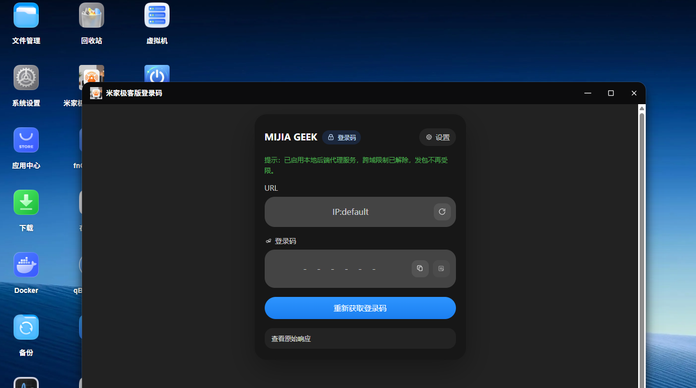
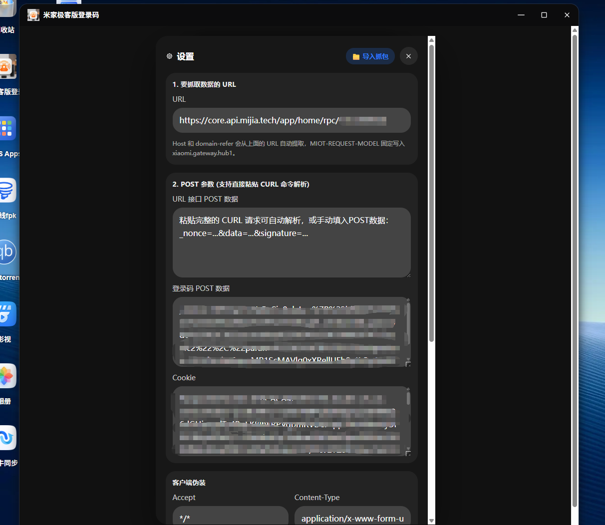
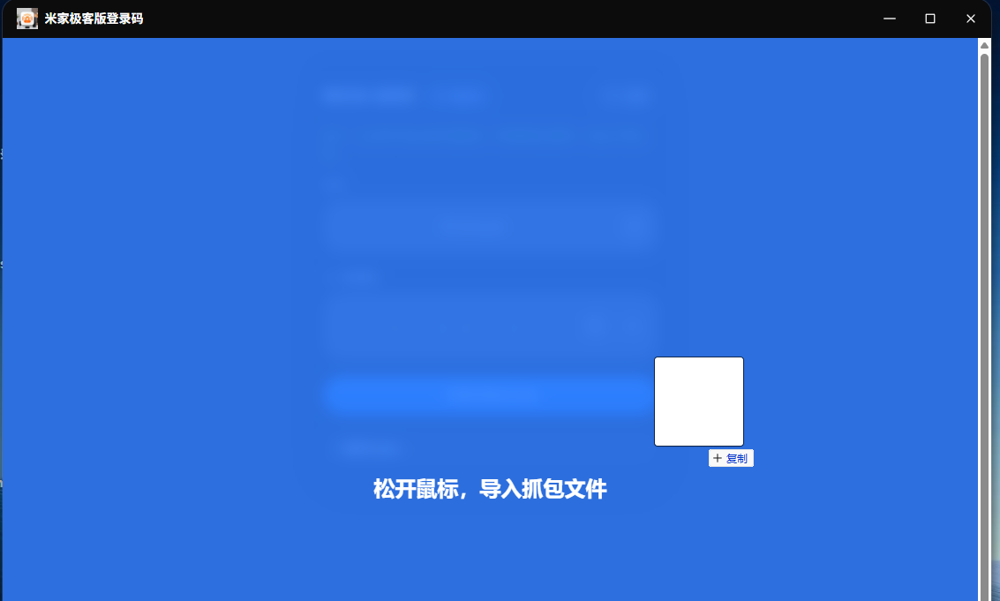
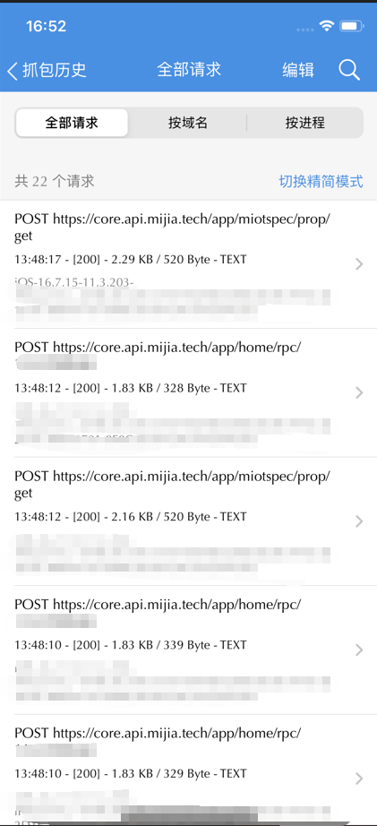
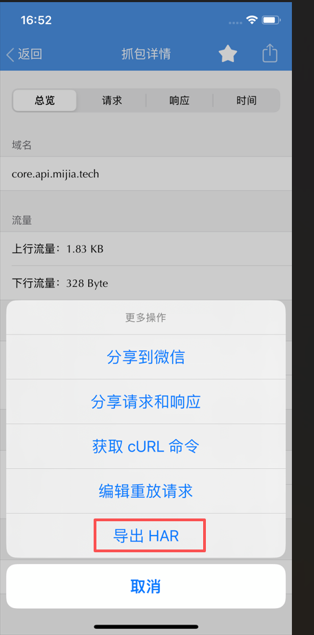

# 米家极客版登录码 - 飞牛 FPK 应用

`fnnas.mijiageek` 是一个运行在飞牛 fnOS 上的米家极客版登录码辅助工具。它通过抓包得到的请求信息，模拟设备向服务器发起请求并获取登录码，减少每次打开米家 App、找到卡片再查看验证码的操作。

应用以飞牛 Native FPK 形式打包。

## 功能

- 获取米家极客版登录码
- 自动识别并解析抓包文件

## 页面展示







## 操作方法

以 iPhone + Stream 为例：

- 安装并配置 Stream，开启抓包
- 打开米家 App，进入中枢网关获取验证码页面
- 停止抓包，在 Stream 右上角搜索 `hub1`
- 找到 `POST https://core.api.mijia.tech/app/home/rpc/XXXXXX` 请求，进入详情页
- 导出 HAR 文件，并拖到网页中识别

## 目录说明

```text
.
├── fnnas/                    # 飞牛 Native 应用工程目录
│   ├── app/
│   │   ├── server/           # Python 后端和 HTML 前端
│   │   └── ui/               # 飞牛桌面入口配置和图标
│   ├── building/             # 打包配置
│   ├── cmd/                  # 安装、启动、停止、配置回调脚本
│   ├── config/               # 权限和资源声明
│   ├── wizard/               # 安装/配置/升级向导
│   └── manifest              # 应用元信息
├── images/                   # README 页面展示截图
└── README.md
```

## 参考文档

- 飞牛 Native 应用：https://developer.fnnas.com/docs/core-concepts/native/
- 飞牛应用入口：https://developer.fnnas.com/docs/core-concepts/app-entry/
- 飞牛用户向导：https://developer.fnnas.com/docs/core-concepts/wizard/
- fnpack 打包工具：https://developer.fnnas.com/docs/cli/fnpack/
